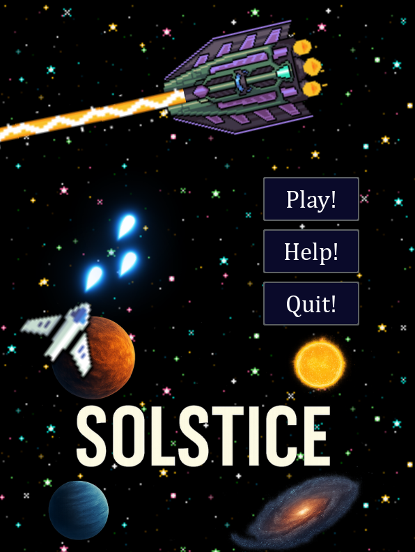
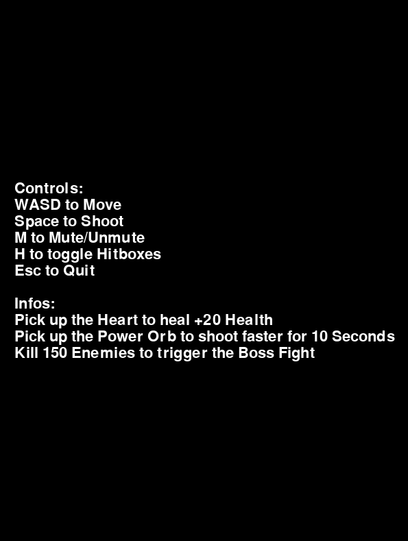
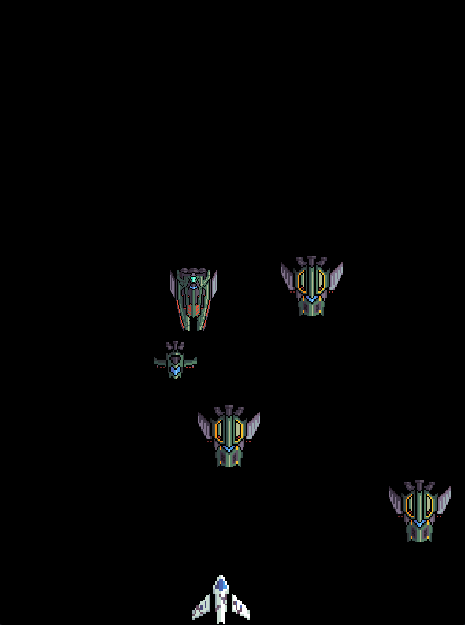
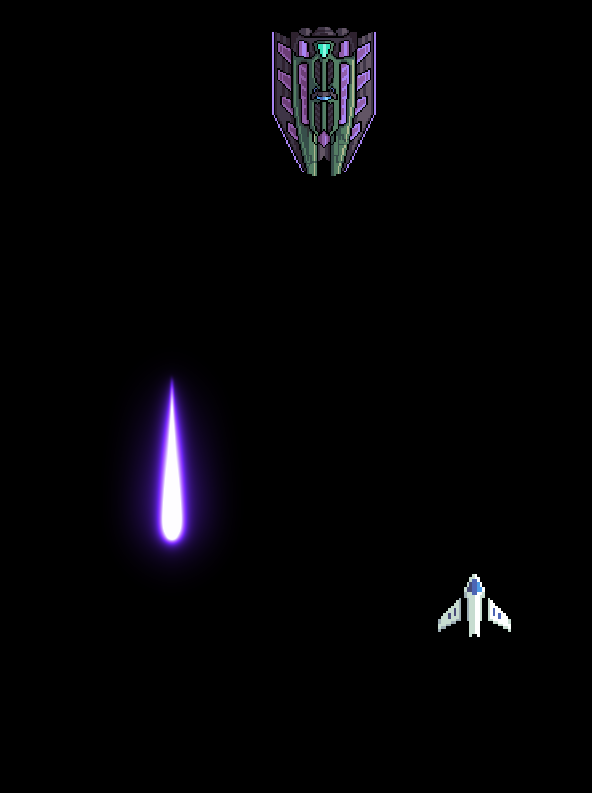
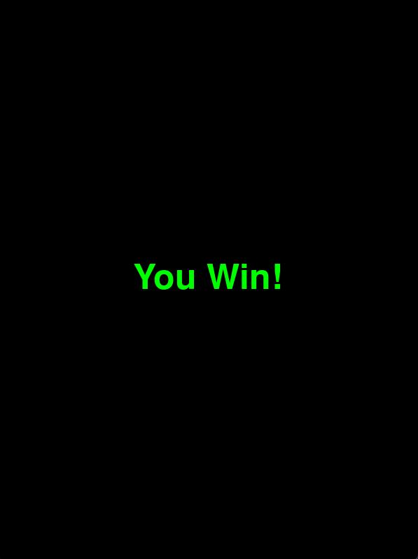
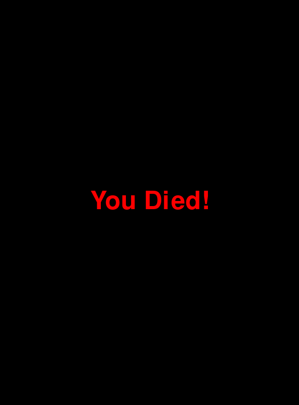

# Inhalt
- [Inhalt](#inhalt)
  - [Abstract](#abstract)
  - [Features](#features)
    - [Umgesetzte Features](#umgesetzte-features)
    - [Nicht-umgesetzte Features](#nicht-umgesetzte-features)
    - [Bugs](#bugs)
  - [GUI Design](#gui-design)
    - [Startscreen](#startscreen)
    - [Helpscreen](#helpscreen)
    - [Gamescreen](#gamescreen)
    - [Bossscreen](#bossscreen)
    - [Winscreen](#winscreen)
    - [Gameoverscreen](#gameoverscreen)
  - [Fazit](#fazit)
---

## Abstract

"Solstice!" Das Ziel war ein Raumschiff Spiel zu machen und das End Ergebnis ist viel besser als geplant. Man steuert ein Raumschiff, schiesst Gegner ab und besiegt den Endboss. Es wurde alles mit Python und Python Libraries gemacht somit wurde das spiel sehr lustig und flüssig.

---

## Features

### Umgesetzte Features

  - Startbildschirm mit einem Play, Help und Quit Button.
  - Spiel mit bewegenden Gegnern die Laser auf den Spieler schiessen.
  - Spiel mit WASD bewegenden Raumschiff, das mit Space auf Gegner schiessen kann.
  - Gegner verschwinden, wenn sie all ihr Leben verloren haben.
  - Spiel ist fertig, wenn keine Gegner mehr vorhanden sind oder das Raumschiff kein Leben mehr hat.
  - Game Over Bildschirm.
  - Einen Bossfight.
  - Mann kann die Hitboxen mit H ein/austellen.
  - Hintergrund Musik.
  - Mann kann die Music mit M ein/ausstellen
  - Power Orbs die machen das du schneller schiesst für eine bestimmte Zeit.
  - Health Orbs die machen das du +20 leben bekommst.
  - Highscore System.
  - Healthbar für Boss und Spieler.

### Nicht-umgesetzte Features

  - Variablen wie Boss Leben, Anzahl Gegner anpassen im Spiel.
  - Meteoriten die runter fliegen und dir Damage geben.
  
### Bugs

 - *Das spiel kann anfangen zu laggen nach vielen schüssen und spamming usw.*

---

## GUI Design

### Startscreen

### Helpscreen

### Gamescreen

### Bossscreen

### Winscreen

### Gameoverscreen

---
## Fazit

Das Projekt "Solstice" war sehr lehrreich und hat mir sehr viel Spass gemacht zu programmieren.

- **Was lief gut?**

  Die grundlegenden Funktionen wie Bewegung und Schießen konnte ich ohne größere Probleme umsetzen. 

  Das Spiel läuft stabil und erfüllt alle Anforderungen die ich ahtte,

- **Was lief schlecht?**

  Bei der Performance durch die Schüsse und den Gegnern hatte ich noch viel zu verbessern.

  Bei den Hitboxen der Schüsse und Gegner hatte ich am Anfang viele probleme.

- **Wie zufrieden bin ich mit dem Endergebnis?**

  Insgesamt bin ich sehr zufrieden mit dem Enderergebnis, es macht spass zu spielen und dank dem Highscore hat es auch wirkliche Ziele im spiel.

- **Was habe ich gelernt?**

  Ich habe viel über Hitboxen also Rects gelernt und auch wie man kleine Animation erstellt.

  Ich habe sehr sehr viele Dinge in Pygame und Pygame GUI gelernt und kann das auch in der Zukunft sicher mal wieder anwenden.

- **Was würden wir anders machen?**

  Anfangen nicht alles in ein File zu tun das ich nicht immer herumscrollen muss.

- **Fehlt etwas?**

  Ich hätte gerne das Spiel ein wenig schwieriger gemacht und ein bisschen mehr Features.

Ich bin mit dem Projekt sehr zufrieden und habe auch dabei viel gelernt. In der Zukunft werde ich mehr Planen bevor ich anfange zu programmieren. Solstice war für mich ein grosser Erfolg und auch mein erstes richtiges Produkt das ich in der BBC gemacht habe.